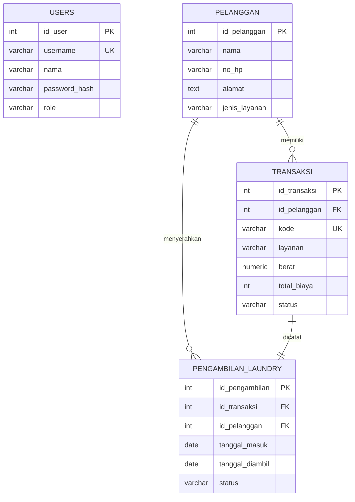

# ERD LaundryKu

```mermaid
 erDiagram
    USERS {
        int id_user PK
        varchar username UK
        varchar nama
        varchar password_hash
        varchar role
    }
    PELANGGAN {
        int id_pelanggan PK
        varchar nama
        varchar no_hp
        text alamat
        varchar jenis_layanan
    }
    TRANSAKSI {
        int id_transaksi PK
        int id_pelanggan FK
        varchar kode UK
        varchar layanan
        numeric berat
        int total_biaya
        varchar status
    }
    PENGAMBILAN_LAUNDRY {
        int id_pengambilan PK
        int id_transaksi FK
        int id_pelanggan FK
        date tanggal_masuk
        date tanggal_diambil
        varchar status
    }
    PELANGGAN ||--o{ TRANSAKSI : memiliki
    PELANGGAN ||--o{ PENGAMBILAN_LAUNDRY : menyerahkan
    TRANSAKSI ||--|| PENGAMBILAN_LAUNDRY : dicatat
```
